# Tugas Pertemuan 6
## Tugas 1: Eksplorasi Database dengan Query

**Nama:** Rahmawati Azizah Afriliani  
**NIM:** 60324025
**Program Studi:** Informatika
**Mata Kuliah:** Pemrograman Web II 

## 1. Statistik Buku (5 Query)

### Total Buku Seluruhnya
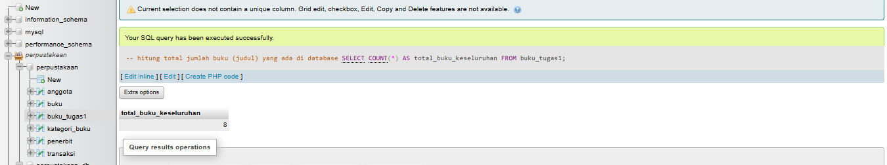
*hitung jumlah total baris/buku yang ada di dalam tabel.*

### Total Nilai Inventaris
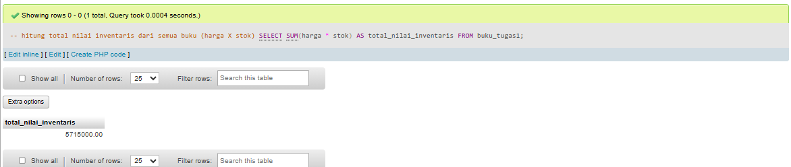
*menjumlahkan hasil perkalian antara harga dan stok untuk setiap buku.*

### Rata-rata Harga Buku
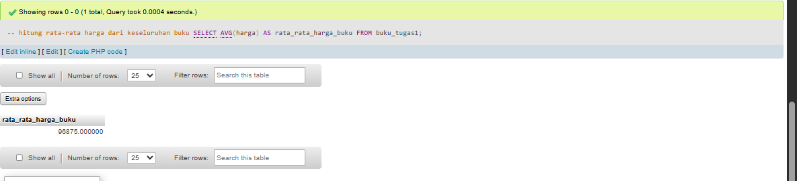
*hitung nilai rata-rata dari kolom harga keseluruhan buku.*

### Buku Termahal
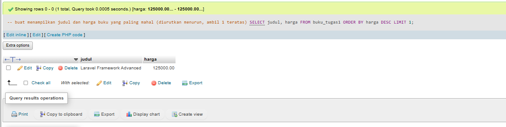
*buat nampilin satu buku dengan harga tertinggi.*

### Buku dengan Stok Terbanyak
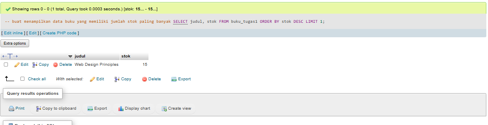
*buat nampilin satu buku yang memiliki angka stok paling tinggi.*

---

## 2. Filter dan Pencarian (5 Query)

### Kategori Programming Harga < 100.000
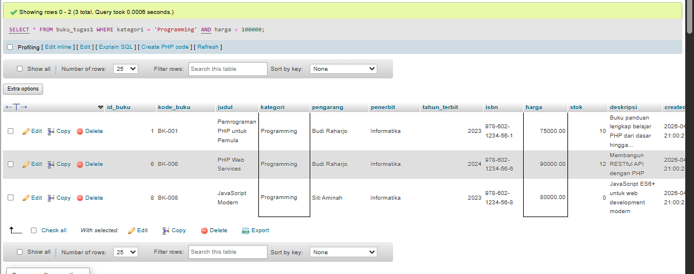

### Judul memiliki kata "PHP" atau "MySQL"
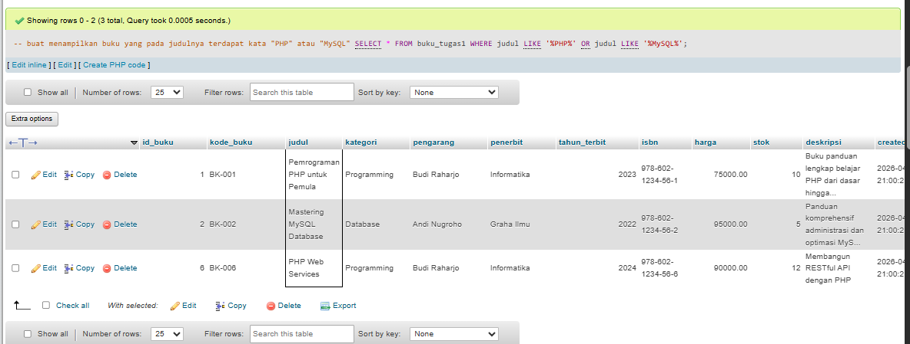

### Buku Terbit Tahun 2024
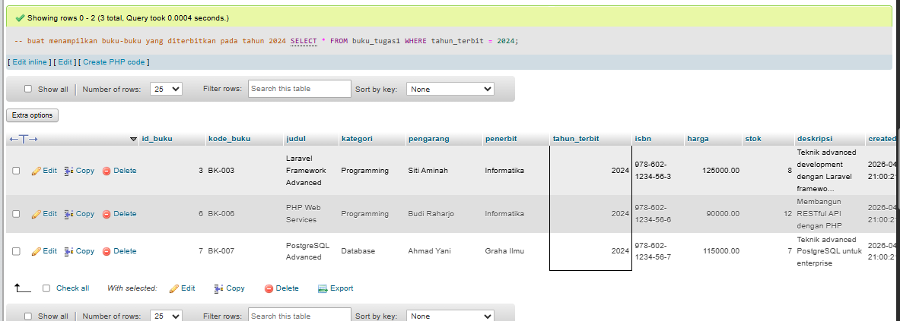

### Stok Antara 5-10
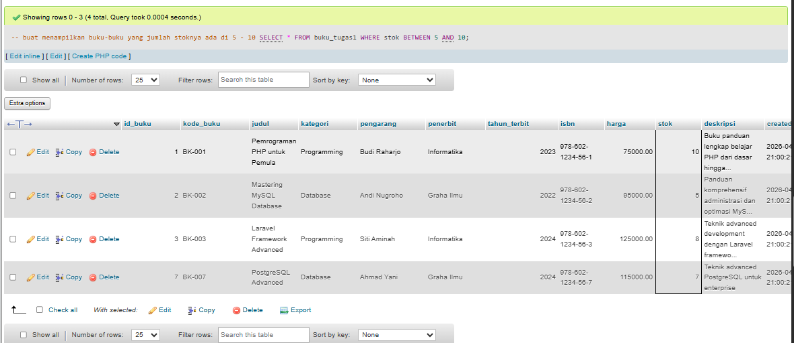

### Pengarang "Budi Raharjo"
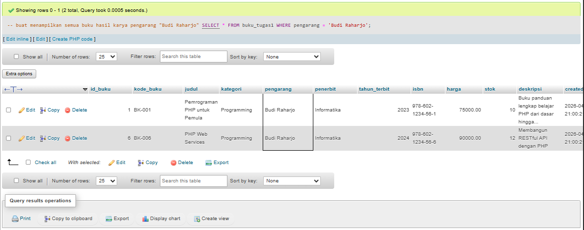

---

## 3. Grouping dan Agregasi (3 Query)

### Jumlah Buku & Total Stok per Kategori
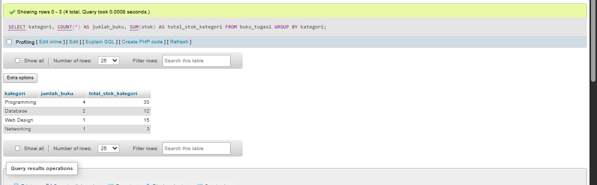

### Rata-rata Harga per Kategori
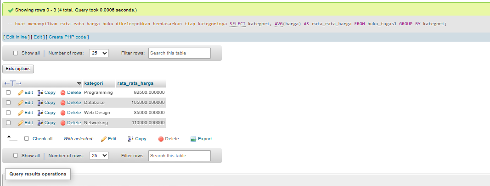

### Kategori dengan Total Nilai Inventaris Terbesar
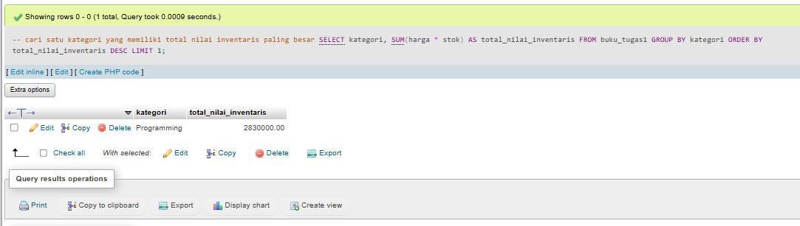

---

## 4. Update Data (2 Query)

### Kenaikan Harga 5% Kategori Programming
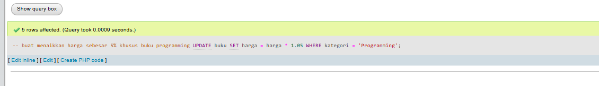
*(Screenshot menunjukkan pesan sukses dari phpMyAdmin bahwa baris telah terpengaruh/berubah)*
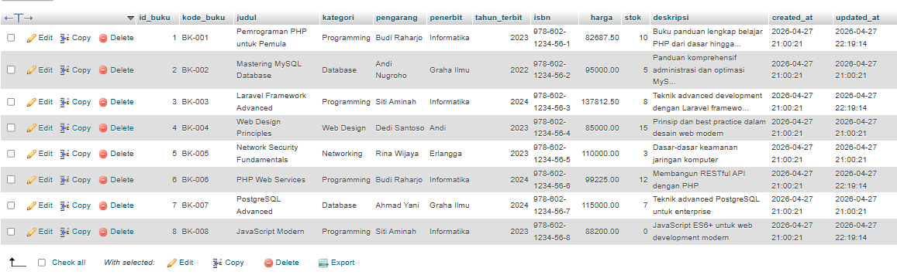
### Tambah Stok 10 untuk Stok < 5
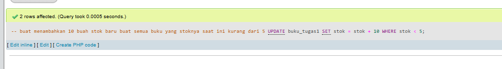
*(Screenshot menunjukkan pesan sukses dari phpMyAdmin bahwa baris telah terpengaruh/berubah)*
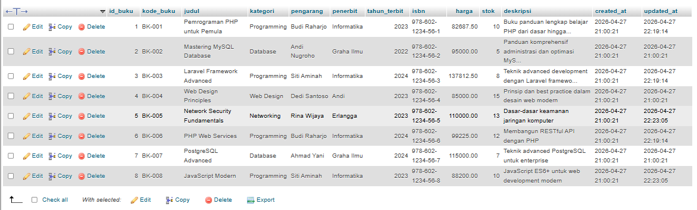

---

## 5. Laporan Khusus (2 Query)

### Daftar Buku Perlu Restocking (Stok < 5)
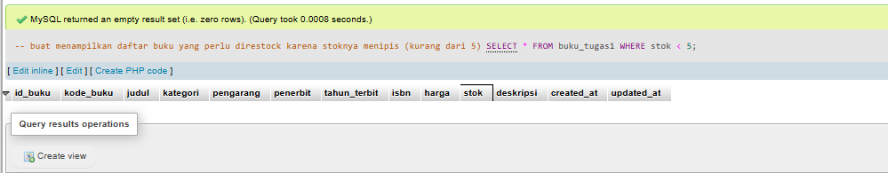
*Jika hasilnya kosong, berarti tidak ada buku dengan stok di bawah 5 setelah query update sebelumnya dijalankan*

### Top 5 Buku Termahal
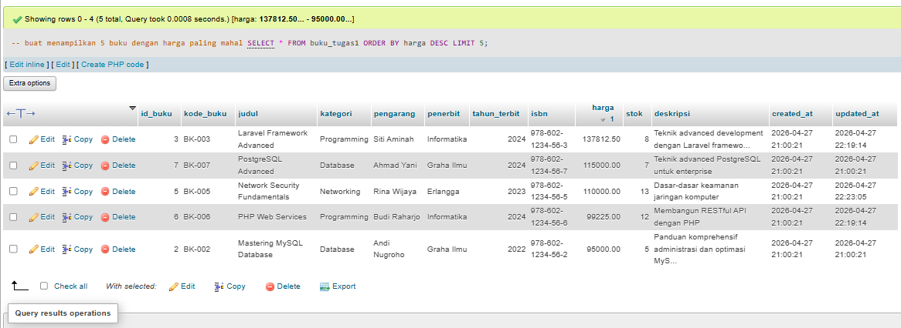

# Tugas 2
## 1. Entity Relationship Diagram (ERD)

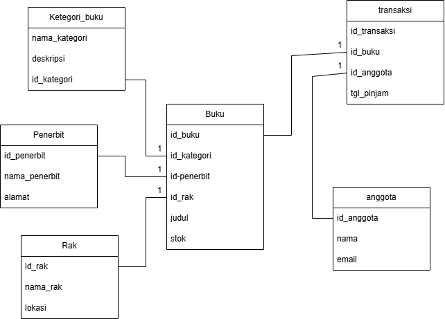

---

## 2. Struktur Semua Tabel:

### 2.1 Relasi Antar Tabel (Designer View)

### 2.2 Struktur Tabel Buku (Detail Foreign Key)

---

## 3. Data di Setiap Tabel

### 3.1 Data Tabel Kategori Buku & Penerbit

### 3.2 Data Tabel Buku (Terdiri dari 15 Buku Minimal)

---

## 4. Hasil Query JOIN
### 4.1 Tampilkan Buku dengan Nama Kategori dan Penerbit

### 4.2 Jumlah Buku per Kategori

### 4.3 Jumlah Buku per Penerbit

### 4.4 Buku Beserta Detail Lengkap (Kategori, Penerbit, Rak)

---

## 5. Fitur tambahan

### 5.1 Tambah Tabel `rak` dengan Relasi ke Buku

### 5.2 Implementasi *Soft Delete*
Seluruh tabel memiliki kolom `is_deleted`. 
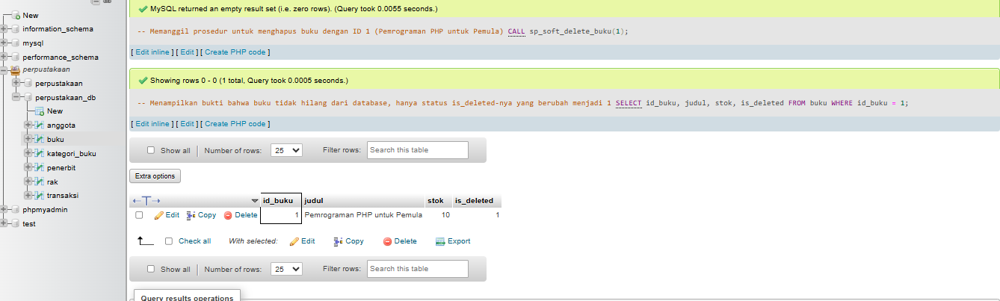

*(Buku dengan ID 1 diubah status is_deleted-nya menjadi 1, bukan dihapus permanen dari sistem).*

### 5.3 *Stored Procedure* untuk Operasi Umum
Pembuatan dan pemanggilan *Stored Procedure* `sp_cek_stok_kritis` dan `sp_soft_delete_buku`:
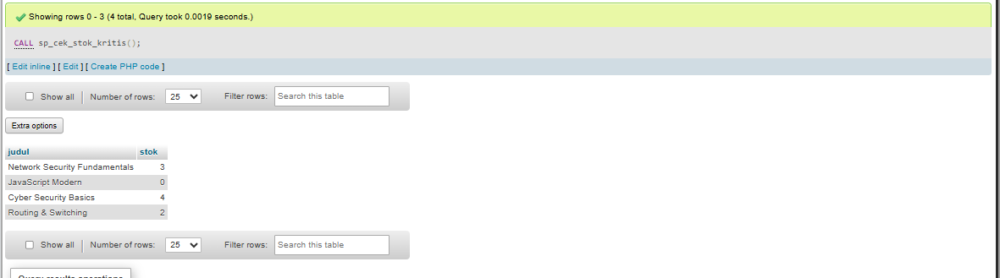
